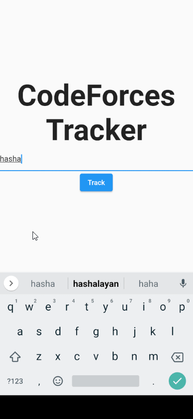

<p align="center">
 
</p>

## Contents
- [Description](#description)
- [Features](#features)
- [How to build](#how-to-build)
# Description

This is a really simple app for me to incorporate ``pub::freezed`` and ```pub::riverpod``` as my quest to learn
more technologies on the Flutter stack.

The main idea is that it uses the CodeForces api to fetch data about a user-provided handle using
the codeforces api.

The models the app uses are generated using ``pub::freezed``, this inherintly exposes me to more clean code
practices.

# Features
- Track a users's progess on codeforces through the offical api
- Dark Mode switch
- Ability to filter a users submissions based on their results
- Different statistics based on various metrics provided by the codeforces api
- Robust error handling, through ``pub::freezed`` and ```pub::riverpod```
- Easy and straight forward implementation
  
# How to build
```sh
$ git clone https://github.com/hashem78/CodeForcesTracker cf
$ cd cf
$ flutter pub get
$ flutter pub build_runner build --delete-conflicting-outputs
$ flutter build apk
```
