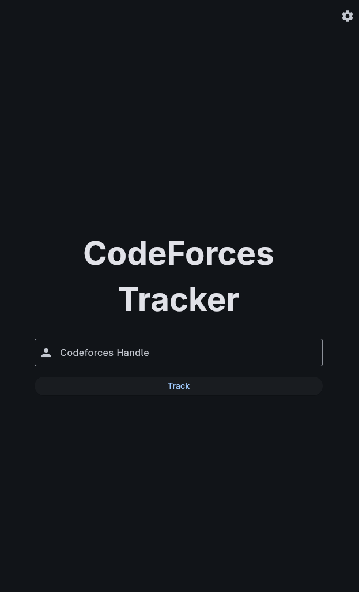
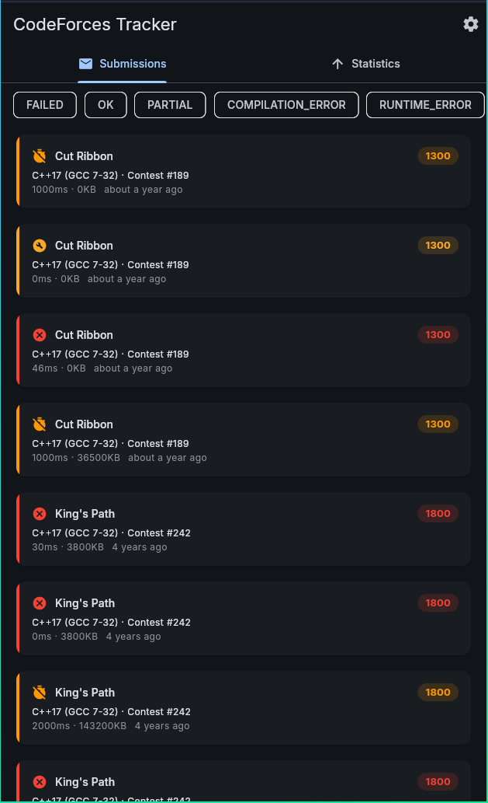
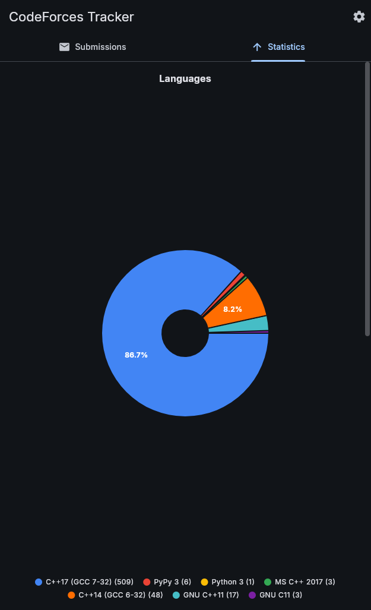
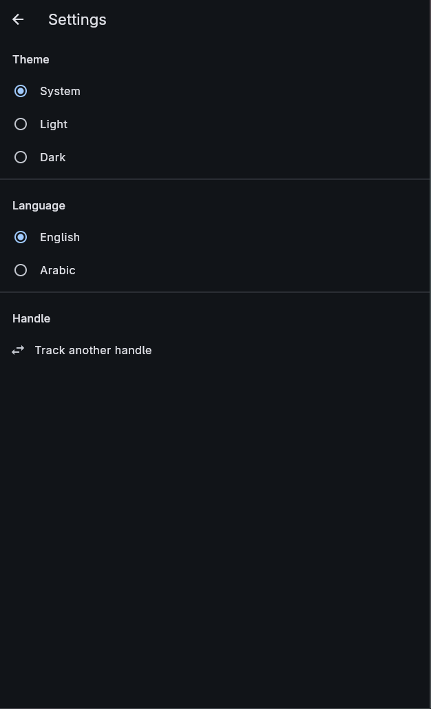

## Contents
- [Description](#description)
- [Screenshots](#screenshots)
- [Features](#features)
- [Tech Stack](#tech-stack)
- [How to Build](#how-to-build)

# Description

A Flutter app that tracks Codeforces user statistics and submissions using the [Codeforces API](https://codeforces.com/apiHelp). Enter a handle to view submission history, language breakdowns, and verdict statistics.

# Screenshots

<p align="center">
  
  
  
  
</p>

# Features
- Track any Codeforces user's submissions and statistics
- Remembered handle across app sessions
- Filter submissions by verdict
- Language and verdict distribution charts
- Dark/light/system theme switching
- English and Arabic localization
- Responsive layout with Material 3

# Tech Stack
- **State management**: Riverpod (code-generated providers)
- **Data models**: Freezed + json_serializable
- **Routing**: auto_route
- **HTTP**: Chopper
- **i18n**: Slang
- **Pagination**: infinite_scroll_pagination

# How to Build
```sh
git clone https://github.com/hashem78/CodeForcesTracker cf
cd cf
flutter pub get
dart run build_runner build --delete-conflicting-outputs
dart run slang
flutter build apk
```
